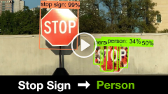
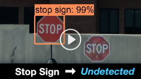
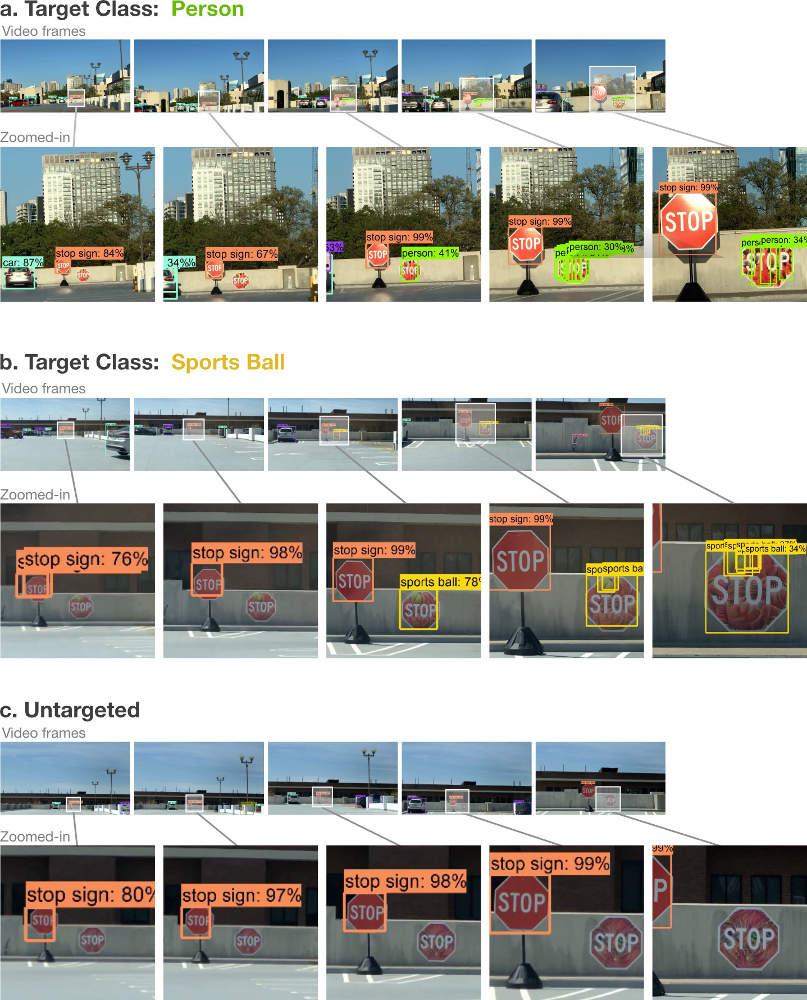

# Robust Physical Adversarial Attack on Faster R-CNN Object Detector

## Overview

This is the code repository for the under-review ECML-PKDD 2018 paper: **Robust Physical Adversarial Attack on Faster R-CNN Object Detector**

The arXiv version is available at https://arxiv.org/abs/1804.05810

The code included here reproduces our techniques presented in the paper. 

In this work, we tackle the more challenging problem of crafting physical adversarial perturbations to fool image-based object detectors like Faster R-CNN.
Attacking an object detector is more difficult than attacking an image classifier, as it needs to mislead the classification results in multiple bounding boxes with different scales.
Our approach can generate perturbed stop signs that are consistently mis-detected by Faster R-CNN as other objects, posing a potential threat to autonomous vehicles and other safety-critical computer vision systems.


## Install Dependencies

This repository depends on Tensorflow Object Detection API.
Follow the installation instructions at https://github.com/tensorflow/models/blob/master/research/object_detection/g3doc/installation.md

## How to Run the Code

Run the ipython notebook by the command
```bash
jupyter notebook robust_physical_attack.ipynb
```

You can also run the code directly using this Colaboratory link. No need to download or install anything!

https://colab.research.google.com/drive/1Vu9HqbIKqXWlr0IH1z3oCq3K3dHE1t4H


## Videos of Targeted and Untargted Attacks

High-confidence Person Perturbation:
https://youtu.be/Zv__RSYIu8c



High-confidence Sports Ball Perturbation:
https://youtu.be/Idoc1vrN2T0


High-confidence Untargeted Attack:
https://youtu.be/8rwoJ93jhY4





Snapshots of the drive-by test results. In (a), the person perturbation was detected 38% of the frames as a person and only once as a stop sign. The perturbation in (b) was detected 11% of the time as a sports ball and never as a stop sign. The untargeted perturbation in (c) was never detected as a stop sign or anything else.


## Researchers

|  Name                 | Affiliation                     |
|-----------------------|---------------------------------|
| Shang-Tse Chen        | Georgia Institute of Technology |
| Cory Cornelius        | Intel Corporation               |
| Jason Martin          | Intel Corporation               |
| Polo Chau             | Georgia Institute of Technology |
